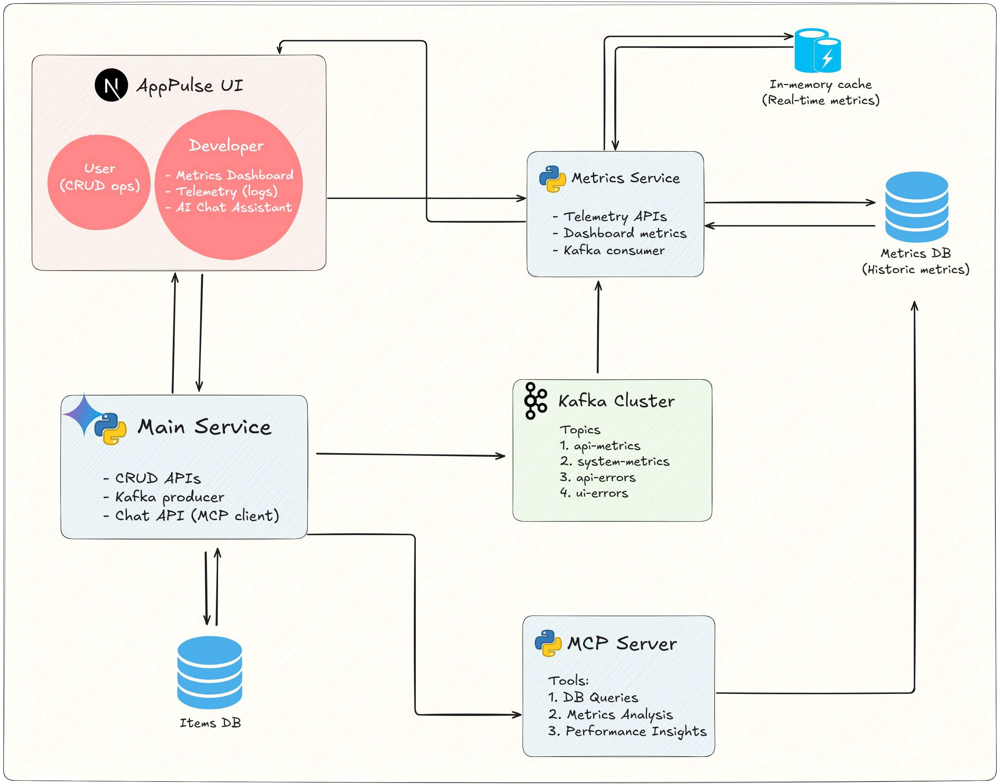

# AppPulse

A comprehensive full-stack monitoring platform with AI-powered insights, built for real-time application health tracking and intelligent performance analysis.

## Overview

AppPulse is an advanced monitoring solution that combines real-time event streaming, comprehensive metrics collection, and AI-powered insights to provide developers with deep visibility into their application's health and performance. It features dual user interfaces and an intelligent AI assistant powered by Google Gemini and Model Context Protocol (MCP).

## Architecture



### Core Components

- **Backend Service** - Python FastAPI with comprehensive API patterns and AI integration
- **Web Application** - Next.js frontend with TypeScript and role-based interfaces
- **Event Streaming** - Apache Kafka for real-time metrics processing and data flow
- **AI Assistant** - Google Gemini LLM with MCP server for intelligent metrics analysis
- **Data Layer** - Hybrid storage with in-memory real-time data and SQLite persistence

### API Endpoints

- `/api/v1/*` - CRUD operations with automatic metrics collection
- `/api/log/*` - Logging, metrics, and dashboard data endpoints
- `/api/chat/*` - AI assistant chat interface with metrics integration

## Features

### 🤖 AI-Powered Insights

- **Intelligent Chat Assistant** - Ask questions about your metrics in plain English
- **Real-time Analysis** - AI analyzes live data to provide actionable insights
- **Performance Recommendations** - Smart suggestions for optimization and issue resolution
- **Natural Language Queries** - "How is my API performing?" gets real metrics-based answers

### 🔧 For Developers

- **Real-time Metrics Dashboard** - Live widgets showing API performance, system health, and errors
- **Comprehensive Monitoring** - API response times, success rates, system resources, and error tracking
- **Interactive Logs Viewer** - Filterable logs with API and UI error separation
- **Performance Trends** - Identify bottlenecks and slow endpoints
- **Test Error Generation** - Built-in tools to test error handling and monitoring

### 👥 For Users

- **CRUD Application Interface** - Full-featured item management with real-time persistence
- **Seamless User Experience** - Clean, responsive interface with automatic error reporting
- **Real-time Data Management** - Create, read, update, delete operations with immediate feedback

### 📊 Advanced Monitoring

- **Hybrid Data Storage** - In-memory for real-time dashboards, SQLite for historical analysis
- **Automatic Error Capture** - Frontend JavaScript errors and API failures automatically logged
- **System Health Tracking** - CPU, memory, and disk usage monitoring with periodic updates
- **Event Streaming** - All metrics flow through Kafka for scalable, real-time processing

## Technology Stack

- **Backend**: Python FastAPI, Pydantic, SQLAlchemy, FastMCP
- **Frontend**: Next.js 14, TypeScript, SCSS, React Hooks
- **AI & MCP**: Google Gemini AI, FastMCP 2.0, Model Context Protocol
- **Streaming**: Apache Kafka with custom consumer/producer services
- **Database**: SQLite with async support and time-series optimization
- **Containerization**: Docker & Docker Compose for Kafka infrastructure
- **Monitoring**: Custom middleware, automatic error capture, real-time metrics collection

## Quick Start

### Prerequisites

- Docker and Docker Compose installed
- Node.js 18+ (for local development)
- Python 3.11+ (for local development)
- Google AI API Key (for AI assistant features)

### Installation

1. **Clone the repository**

   ```bash
   git clone <repository-url>
   cd apppulse
   ```

2. **Environment Setup**

   ```bash
   cp .env.example .env
   # Edit .env with your configuration:
   # - GOOGLE_API_KEY=your_google_ai_api_key
   # - AI_PROVIDER=gemini
   # - KAFKA_BOOTSTRAP_SERVERS=localhost:9092
   ```

3. **Start Kafka Infrastructure**

   ```bash
   docker-compose up -d
   ```

4. **Backend Setup**

   ```bash
   cd backend
   python -m venv venv
   source venv/bin/activate  # On Windows: venv\Scripts\activate
   pip install -r requirements.txt
   uvicorn app.main:app --reload --port 8000
   ```

5. **Frontend Setup**

   ```bash
   cd frontend
   npm install
   npm run dev
   ```

6. **Access the Application**
   - Web App: http://localhost:3000
   - Backend API: http://localhost:8000
   - Kafka UI: http://localhost:8080
   - API Documentation: http://localhost:8000/docs

## Project Structure

```
apppulse/
├── backend/                    # FastAPI backend service
│   ├── app/
│   │   ├── main.py            # Application entry point
│   │   ├── config.py          # Configuration management
│   │   ├── routers/           # API route handlers
│   │   │   ├── v1/            # CRUD operations with metrics
│   │   │   ├── log/           # Logging and dashboard APIs
│   │   │   └── chat.py        # AI assistant chat API
│   │   ├── services/          # Business logic services
│   │   │   ├── kafka_service.py        # Kafka producer
│   │   │   ├── kafka_consumer.py       # Kafka consumer
│   │   │   ├── message_handler.py      # Message processing
│   │   │   ├── memory_storage.py       # In-memory metrics
│   │   │   ├── metrics_service.py      # Metrics collection
│   │   │   └── chat_service.py         # AI chat integration
│   │   ├── middleware/        # Request/response middleware
│   │   │   └── metrics_middleware.py   # Auto metrics collection
│   │   ├── models/            # Data models and schemas
│   │   │   ├── database.py    # SQLAlchemy models
│   │   │   └── schemas.py     # Pydantic schemas
│   │   ├── database/          # Database configuration
│   │   │   └── connection.py  # SQLite setup
│   │   └── mcp/               # Model Context Protocol
│   │       └── metrics_server.py      # MCP tools for AI
│   ├── requirements.txt       # Python dependencies
│   └── Dockerfile            # Docker configuration
├── frontend/                  # Next.js frontend application
│   ├── src/
│   │   ├── app/
│   │   │   ├── page.tsx       # Home page with persona selection
│   │   │   ├── user/          # User persona (CRUD interface)
│   │   │   └── developer/     # Developer persona (monitoring)
│   │   │       ├── page.tsx   # Main developer dashboard
│   │   │       └── components/
│   │   │           ├── Dashboard.tsx  # Metrics widgets
│   │   │           ├── Logs.tsx       # Log viewer
│   │   │           └── Chat.tsx       # AI assistant
│   │   ├── services/
│   │   │   ├── api.ts         # API client configuration
│   │   │   └── errorLogger.ts # Automatic error capture
│   │   └── types/
│   │       └── index.ts       # TypeScript definitions
│   ├── package.json          # Node.js dependencies
│   └── next.config.js        # Next.js configuration
├── kafka/                    # Kafka configuration
│   └── topics/
│       └── create-topics.sh  # Topic initialization script
├── data/                     # SQLite database storage
│   └── apppulse.db          # Application database
├── docker-compose.yml        # Kafka infrastructure
├── .env                      # Environment configuration
└── README.md                 # Project documentation
```

## Monitoring Capabilities

### Real-time Metrics Collection

```
┌─────────────────┐    ┌─────────────────┐    ┌─────────────────┐
│   API Request   │───▶│  Middleware     │───▶│  Kafka Topics   │
│   (Automatic)   │    │  Collection     │    │  (Event Stream) │
└─────────────────┘    └─────────────────┘    └─────────────────┘
                                                       │
┌─────────────────┐    ┌─────────────────┐    ┌─────────────────┐
│   Dashboard     │◄───│  In-Memory      │◄───│  Kafka Consumer │
│   (Real-time)   │    │  Storage        │    │  (Processing)   │
└─────────────────┘    └─────────────────┘    └─────────────────┘
                                                       │
                       ┌─────────────────┐    ┌─────────────────┐
                       │  Historical     │◄───│  Database       │
                       │  Analysis       │    │  (SQLite)       │
                       └─────────────────┘    └─────────────────┘
```

### Collected Metrics

#### Backend Metrics

- **API Performance**: Request/response times, throughput, success rates
- **System Resources**: CPU usage, memory consumption, disk utilization
- **Error Tracking**: API failures, exception details, error patterns
- **Custom Events**: Business logic events, user actions, system events

#### Frontend Metrics

- **Error Monitoring**: JavaScript errors, unhandled exceptions, promise rejections
- **User Interactions**: Click events, form submissions, navigation patterns
- **Performance**: Page load times, component render times, client-side metrics
- **Custom Events**: Application-specific user behavior and business events

### AI-Powered Analysis

#### Model Context Protocol (MCP) Integration

The AI assistant uses MCP to access real-time metrics through specialized tools:

- `get_api_metrics_summary()` - Comprehensive API performance analysis
- `get_system_metrics_summary()` - System health and resource utilization
- `get_error_analysis()` - Error patterns and failure analysis
- `get_performance_trends()` - Performance bottlenecks and optimization insights

#### Natural Language Queries

Ask questions like:

- _"How is my API performing today?"_
- _"Are there any concerning error patterns?"_
- _"Which endpoints are causing performance issues?"_
- _"What's the overall health of my system?"_
- _"Show me recent error trends and their impact"_

## API Documentation

### REST API Endpoints

#### CRUD Operations (`/api/v1/*`)

```http
GET    /api/v1/items           # List all items
POST   /api/v1/items           # Create new item
GET    /api/v1/items/{id}      # Get specific item
PUT    /api/v1/items/{id}      # Update item
DELETE /api/v1/items/{id}      # Delete item
```

#### Monitoring & Logging (`/api/log/*`)

```http
GET    /api/log/dashboard-data # Real-time dashboard metrics
POST   /api/log/errors         # Log UI errors
POST   /api/log/system-metrics # Trigger system metrics collection
GET    /api/log/api-logs       # Retrieve API error logs
GET    /api/log/ui-logs        # Retrieve UI error logs
```

#### AI Assistant (`/api/chat/*`)

```http
POST   /api/chat/chat          # Chat with AI assistant
```

**Example Chat Request:**

```json
{
  "message": "How is my API performing today?",
  "conversation_history": [
    { "role": "user", "content": "Previous question" },
    { "role": "assistant", "content": "Previous response" }
  ]
}
```

### Interactive Documentation

Once running, visit:

- **Swagger UI**: http://localhost:8000/docs

## License

This project is licensed under the MIT License - see the [LICENSE](LICENSE) file for details.

**Built with 🩵 using modern web technologies and Claude Code**

_AppPulse - Intelligent monitoring for the modern web_
